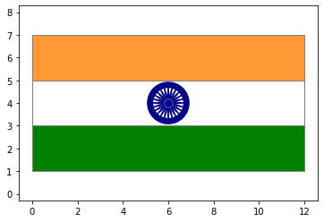

# FlagWithML
This a basic project, kind of a fun project to get better understanding of libraries and the ways in which they can be used.
We have created a flag with help of Machine Learning libraries. Measurements for flag sections are given along with chakra's radius and the way in which chakra's sticks can be formed. 
### Output
The output of the code will look as given in the output diagram.

